<picture>
  <source media="(prefers-color-scheme: dark)" srcset="banner-dark.svg">
  
</picture>

 

Делаю **[Axiom](https://axiom-web.fun)** — сервис страниц «ссылка в био». Одна ссылка в профиле, а за ней всё, что ты делаешь: соцсети, музыка, видео, работы и контакты — в оформлении под себя, а не по шаблону.

Вайбкодер, работаю в Figma.

#### Сейчас

- Axiom открыт по приглашениям. Моя страница — [axiom-web.fun/@kekw](https://axiom-web.fun/@kekw)
- Редактор с шаблонами, музыкой и видео
- Статистика страницы без cookie и без слежки за посетителями

#### Чем пользуюсь

`Nuxt 4` &nbsp; `Vue 3` &nbsp; `TypeScript` &nbsp; `SQLite` &nbsp; `nginx` &nbsp; `Figma`

#### Связь

- Telegram — [@opnginx](https://t.me/opnginx)
- Канал Axiom — [t.me/axiomweb](https://t.me/axiomweb)
