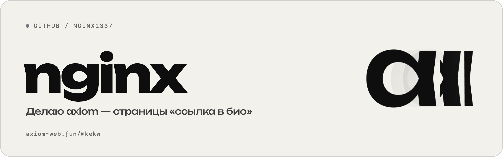

<picture>
  <source media="(prefers-color-scheme: dark)" srcset="banner-dark.png">
  
</picture>

 

## Про меня

Я nginx. Вайбкодер, работаю в Figma.

Придумываю и собираю интерфейсы, один делаю свой сервис — axiom.

**Чем пользуюсь**

`Figma` &nbsp; `Nuxt 4` &nbsp; `Vue 3` &nbsp; `TypeScript` &nbsp; `SQLite` &nbsp; `nginx`

**Связь**

- Telegram — [@opnginx](https://t.me/opnginx)
- Моя страница — [axiom-web.fun/@kekw](https://axiom-web.fun/@kekw)

## Проект: axiom

**[axiom](https://axiom-web.fun)** — сервис страниц «ссылка в био». Одна ссылка в профиле, а за ней всё, что ты делаешь: соцсети, музыка, видео, работы и контакты — в оформлении под себя, а не по шаблону.

- Редактор с шаблонами, музыкой и видео
- Статистика страницы без cookie и без слежки за посетителями
- Постеры с QR-кодом страницы для сторис и печати
- Доступ пока по приглашениям

Новости проекта — в канале [t.me/axiomweb](https://t.me/axiomweb)
